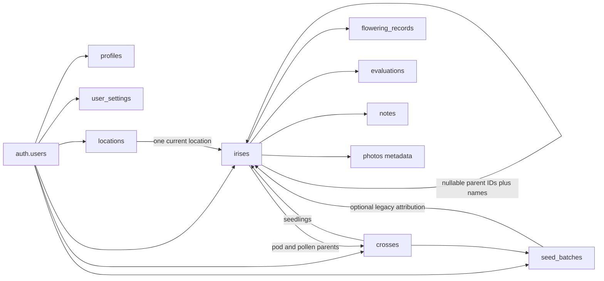

# Codex initial takeover audit — Pod & Pollen

Audit date: **9 September 2026**. Repository: `davethesloth123/pod-and-pollen`. Local checkout: `/Users/davidsergeant/Sites/pod-and-pollen`. Audit branch: `codex/initial-audit`. Application examined at **`ec2fbc6a1e4d70bf6ab4a6446822fe42824b7cd8`**.

This is an assessment and implementation plan, not a remediation. No application, dependency, migration, database, authentication configuration or deployment changes were made for this audit. Findings describe this snapshot, not future releases. The two audit documents supplement, rather than rewrite, Claude's historical handover.

Evidence labels: **source-confirmed** means the implementation was traced; **locally reproduced** means a browser or isolated in-memory check demonstrated it; **live read-only** means an existing-project SELECT/catalog inspection; **potential** means an unexercised scenario supported by code/schema; **not verified** means evidence is insufficient. A successful build does not establish correct business behavior. Source-confirmed write defects were not reproduced against protected records.

## 1. Executive summary

Pod & Pollen is a credible, coherent early application with real Supabase persistence, a useful iris/breeding model, annual flowering records and a data-driven BIS evaluation flow. It is suitable for controlled development and read-only investigation. It is **not ready for wider use as the sole safe repository of irreplaceable breeding records**, or for commercialization.

The principal problem is trust in stored history: a new flowering entry can replace fields in the same year's existing entry; US edit forms round canonical measurements even when the measurement was not intentionally changed; multi-step saves can report overall success after a secondary failure; hard deletes have cascading consequences and no verified recovery workflow. Several prototype actions still imply persistence that does not exist.

Finding groups: **P0: 0; P1: 10; P2: 18; P3: 4**. Counts refer to the numbered groups in sections 25–28, not individual feature-matrix rows. No confirmed catastrophic incident was discovered. Potential serious integrity/security failures remain urgent even though this audit did not write records or attempt exploits.

Five biggest risks are accidental overwrite/precision loss, deletion without recovery, incomplete multi-record saves, unproven relationship isolation, and affected runtime dependencies. The first implementation phase should establish truthful behavior and protect existing history, alongside a narrowly scoped security dependency review. Preserve the working domain model and UI investment; a rewrite would increase risk without solving these specific defects.

## 2. Product understanding

The product is a specialist field notebook for iris growers and hybridisers. Its lasting value is a connected record over years: an individual plant has known or external parents; a cross produces seed and treatment lots; seedlings retain provenance; flowering measurements and evaluations accumulate; plants are retained, discarded or named. A registered variety name, an individual plant record and a permanent seedling identifier are related but different concepts.

A garden location answers where a plant is grown. The June requirements extend this into structured beds/grids and multiple current locations; these are more than rectangular shapes on a visual map. Seed lots compare treatment/germination outcomes. June's decision associates seedlings with the cross without requiring individual seed-lot attribution. First-ever flowering is distinct from one annual record and from a temporary “Flowering” status. Rebloom potential is distinct from multiple bloom episodes.

The intended user may be outdoors, older, or uncomfortable with software. Reliable saving, clear units, readable controls, recovery and guidance are core product requirements. Photos and portable backups are part of the intended value, not ornamental extras. Later commercialization and other hybridized plant types should extend this specialist depth through explicit domain modules, not erase it with an early generic “plant” abstraction.

Sources reviewed: [founding brief](../../project/uploads/My_Iris_Tracker_Project_Brief_V2_1.pdf), [June feedback](../feedback-brief-2026-06-25.md), [June plan](../build-plan-2026-06-25.md), all documents in [handover](../handover/README.md), root handover/AGENTS/README/BACKLOG, historical chat user decisions, relevant prototype flows/navigation/data, seed generator, all current application source and migrations. Historical screenshots/prototypes are design evidence, not evidence that a feature persists today. Current user instructions settle the date convention as **UK `dd/mm/yyyy` + centimetres; US `mm/dd/yyyy` + inches**.

## 3. Current project health

| Area | Assessment |
|---|---|
| Product/UI coherence | Strong foundation; specialist terminology, mobile layouts and connected records are recognizable. |
| Core persistence | Real owner-filtered Supabase queries; several multi-step integrity gaps. |
| Data safety | Insufficient recovery, validation and regression coverage for sole-copy records. |
| Security | All ten tables have RLS; anonymous reads return no protected rows. Relationship ownership and current dependency alerts need work. |
| Runtime | Signed-out local flow and production compilation work. Authenticated local smoke coverage remains incomplete. |
| Delivery | Reproducible lockfile, working typecheck/build; lint unavailable, no tests or CI. |
| Feature completeness | Core CRUD substantially implemented; photos, portability, offline, Help and deeper garden/seedling workflows incomplete. |
| Takeover readiness | Enough evidence to begin scoped remediation after approval; not a release sign-off. |

## 4. Runtime verification

The local app was connected to the existing `pod-pollen-dev` project using only public browser credentials in Git-ignored `.env.local`. No service-role key was used. Local auth returned HTTP 200; the welcome, sign-in, signup and reset-request views rendered during setup/audit. A fresh in-app browser rendered welcome/sign-in/reset and reported no console errors at the checked sign-in state. Earlier Chrome hydration noise was attributable to Grammarly-injected body attributes; it did not recur in the clean browser. Server logs for inspected requests showed successful auth/icon responses, not application exceptions.

Supabase client initialization and signed-out session initialization succeeded. GET-only API checks returned 200 for all ten expected tables and no anonymous protected rows; a joined iris/location query accepted the expected columns. Empty anonymous results are evidence of filtering, **not** evidence that the database is empty. Dashboard SELECTs subsequently confirmed real records and live policies. Email authentication is enabled; current configuration auto-confirms email signup. No auth email was sent and no account was created or changed.

No safe authenticated local app session became available. Therefore the authenticated home, collection, cross, garden and edit-sheet behavior was inspected in source, not certified by a live end-to-end walkthrough. Dashboard access is not an application login and does not test RLS as an ordinary user. No save/delete/favourite/status action, onboarding completion, drag autosave or other database-writing UI interaction was performed. Local runtime checks were completed before stopping the development server for final build verification.

| Verification | Result and limit |
|---|---|
| Dependency installation | Existing setup's `npm ci` completed; not rerun or upgraded during audit. |
| TypeScript | `npx tsc --noEmit` is the available static check; final result recorded in section 21. |
| Production build | `npm run build` works with local public environment; final result in section 21. |
| Lint | `next lint` enters an interactive setup prompt because configuration is absent; not a passing lint check. |
| Business logic | Isolated transpilation/VM checks of existing functions reproduced measurement rounding, leap-year averaging and flowering payload null replacement, and simulated an ignored initial-note error. No repository test files or database writes. |
| Browser | Signed-out render/navigation only; no authenticated or destructive smoke test. |
| Live database | Aggregates, catalog and RLS inspection only; detailed coverage in section 8. |

Environment inventory:

| Variable | Purpose | Needed to start? | Local value policy / service |
|---|---|---|---|
| `NEXT_PUBLIC_SUPABASE_URL` | Supabase browser/server client endpoint | Yes | Existing project's public URL; Supabase. |
| `NEXT_PUBLIC_SUPABASE_ANON_KEY` | Browser-safe API credential; RLS remains authorization | Yes | Existing public anon/publishable credential; never substitute a service-role key. |
| `NEXT_PUBLIC_APP_URL` | Password-reset redirect base | No for ordinary startup; relevant to reset requests | `http://localhost:3000` locally; route/allowlist still incomplete. |
| `NEXT_PUBLIC_ENV` | Example/configuration label | No; no current source consumer found | `development` is safe; it does not currently display an environment badge. |

External dependencies: Supabase Postgres/Data API/Auth; Vercel hosting appears connected through GitHub; Google font loading is used by the application styling. No working photo-storage integration or third-party plant API was found. Supabase Storage has zero buckets. Local access to the existing database is not an isolated test environment.

## 5. Feature implementation matrix

Statuses assess implementation, not permission to exercise writes. “MOSTLY COMPLETE” does not claim authenticated end-to-end verification. Evidence paths are relative to the repository root; numbered findings below provide reproducible detail.

### Authentication and records

| Feature | Status | Evidence / limitation |
|---|---|---|
| Welcome/auth view selection | COMPLETE | `src/app/auth/page.tsx` and auth components; signed-out browser rendering verified. |
| Signup | PARTIAL | Real auth request and profile upsert; profile error ignored, assumes current confirmation behavior; no submission tested. |
| Sign-in | MOSTLY COMPLETE | Supabase password flow and error state; successful local login not exercised. |
| Sign-out | PARTIAL | Confirmation and auth call; returned error not inspected before navigation. |
| Password reset | BROKEN | Request UI exists; recovery route/new-password completion absent (P1-10). |
| Account isolation | PARTIAL | Live RLS/anonymous tests good; relationship checks absent (P1-05). |
| Local development auth | PARTIAL | Initializes/renders; localhost reset redirect not configured. |
| Iris create | MOSTLY COMPLETE | `flows/add-iris.tsx`, `insertIris`; initial note can fail silently (P1-03). |
| Iris edit | PARTIAL | Persisted patch; precision, rename and validation defects. |
| Iris detail/view | MOSTLY COMPLETE | Notes, lineage, flowering/evaluations rendered from provider; photos absent. |
| Iris delete | PARTIAL | Real hard delete and confirmation; cascades/recovery deficiencies (P1-04). |
| Classification | MOSTLY COMPLETE | Fourteen UI choices; broad text storage, no DB vocabulary constraint. |
| Colour type | MOSTLY COMPLETE | Twelve UI choices for varieties; unconstrained text; seedling entry limited. |
| Height/appearance/colour definition | PARTIAL | Stored fields and displays exist; US edits quantize, seedling form less complete. |
| Notes create/edit | MOSTLY COMPLETE | Real writes and inline failures; initial-note exception noted separately. |
| Notes delete | NOT IMPLEMENTED | Query/context method exists but no reachable UI caller found. |
| Parentage | PARTIAL | IDs plus external names; ambiguous name healing/partial rename risk. |
| Offspring | MOSTLY COMPLETE | Derived from cross/parent IDs and name fallbacks; depends on consistent loaded data. |
| Single location assignment/movement | MOSTLY COMPLETE | Iris location FK changes; no multiple assignment model. |
| Grid reference | PARTIAL | Free text only; no bed cell/occupancy validation. |
| Photos capture/upload | PLACEHOLDER | Save callback/toast without file selection/upload/persistence. |
| Photos view/edit/delete/download | PLACEHOLDER | Viewer shell; provider gives empty photo arrays; callbacks are not storage operations. |
| Naming/renaming | PARTIAL | Name patch/cascade; no separate permanent seedling identity. |
| Favourite/status/rebloom toggle | MOSTLY COMPLETE | Real iris patches; status is manual, not annual-history-derived. |
| Collection grid/list/filter/sort | MOSTLY COMPLETE | Several substantive sorts; view/filter persistence and incoming favourites bug. |
| Search | PARTIAL | Name/class/location/parents/colour text; suggestions/show-all defects; no full notes search. |

### Flowering and breeding

| Feature | Status | Evidence / limitation |
|---|---|---|
| First-ever flowering | PARTIAL | Database/domain field exists, no complete input/derivation lifecycle. Existing values all empty. |
| Annual flowering records | MOSTLY COMPLETE | Unique iris/year and upsert, history UI; same-year blank replacement defect. |
| First and last flower by year | PARTIAL | Optional inputs; no ordering/year/date validity constraint; legacy slash dates present. |
| Rebloom flag | COMPLETE | Migration 006, iris mapping/toggle/filters; expresses potential only. |
| Multiple flowering episodes | NOT IMPLEMENTED | One annual first/last row cannot express separate spring/autumn episodes. |
| Optional flowering measurements | MOSTLY COMPLETE | Stems/buds/branches/stem height/bloom height/width nullable; US quantization. |
| Average display period/duration | BROKEN | Leap-year normalization reproduced wrong; legacy formats excluded/ambiguous. |
| Protection of other years | COMPLETE | DB unique composite key distinguishes years. |
| Protection of existing same year | BROKEN | “Record flowering” can null existing fields (P1-01). |
| Flowering history display/edit | PARTIAL | Annual list/edit present; validation and first-ever/current-state issues. |
| Current in-flower screen | PARTIAL | Uses manual status, not proof of current-season flowering. |
| Calendar home widget | PLACEHOLDER | Hard-coded monthly counts, no calendar navigation. |
| Full calendar | PARTIAL | Implemented but unreachable; aggregates historical records inconsistently. |
| Create cross | MOSTLY COMPLETE | Real insert, code/parent/date inputs; no DB code uniqueness. |
| Seed parent / pollen parent | PARTIAL | Select existing records; unknown/external cross parent entry not fully supported. |
| Cross lineage references | PARTIAL | IDs and stored names; ownership/cascade issues. |
| Cross list/summary/detail | MOSTLY COMPLETE | Real cross/offspring/count displays and seed-batch card. |
| Seed-batch save | PARTIAL | Read-then-update/insert assumes at most one row per cross; lookup errors ignored. |
| Multiple lots / treatment comparison | NOT IMPLEMENTED | Table allows multiple; UI/provider select one and no comparison. |
| Add seedlings | PARTIAL | Bulk insert works in code; repeated generated identifiers can duplicate. |
| Permanent seedling number | NOT IMPLEMENTED | Name is mutable identity; no independent number/naming record. |
| Outcome status | PARTIAL | Generic iris statuses/legacy verdicts exist; June outcome workflow absent. |
| BIS scorecard | MOSTLY COMPLETE | Ten capped categories, total 100, complete-card validation; DB JSON unvalidated. |
| Evaluation history/edit/delete | PARTIAL | Real data/write paths; duplicates, stale sheet snapshot, silent delete failure. |
| Legacy evaluation compatibility | PARTIAL | Older fields retained; unreachable comparison uses legacy scores rather than current BIS. |
| Cross comparison view | PARTIAL | Renderer exists but no incoming navigation target found. |
| Cross deletion | PARTIAL | Deletes batches, unlinks seedlings; warning omits batch loss. |

### Garden, settings and supporting product

| Feature | Status | Evidence / limitation |
|---|---|---|
| Location create/edit/delete | PARTIAL | Real persistence; rename/stale join, clearing/error handling issues. |
| Empty locations | MOSTLY COMPLETE | Present in map/list without plants; geometry defaults differ across views. |
| Visual garden map/editor | MOSTLY COMPLETE | Real rectangle placement/resizing, persisted x/y/w/h. BACKLOG is stale. |
| Drag/move/resize autosave | PARTIAL | Real writes; no robust failure/retry/ordering handling; mouse/touch oriented. |
| Structured beds and rows/columns | NOT IMPLEMENTED | Location kind “Bed” is not a cell model. |
| Cell occupancy / grid validation | NOT IMPLEMENTED | Free-text `grid_ref`; no collisions/capacity checks. |
| Multiple current locations per plant | NOT IMPLEMENTED | Single `location_id`; no join table or quantities. |
| Movement history | NEEDS PRODUCT DECISION | Founding brief included history; June explicitly deprioritizes it versus multiple current locations. |
| Garden → iris navigation | BROKEN | Invalid `irisDetail` target (P1-08). |
| Region preference | MOSTLY COMPLETE | Per-user browser storage, affects display, not synced settings. |
| Date format | PARTIAL | Correct UK/US order but hyphens rather than current required slashes. |
| Units/conversion | PARTIAL | Canonical cm/display inches; edit precision loss, region switching alone does not write cm. |
| Customize home | MOSTLY COMPLETE | Local widget persistence/reorder; system widget position restrictions imperfect. |
| Data section import/export | PLACEHOLDER | Coming Soon/disabled; import view not reached from settings. |
| Backup/restore/portability | NOT IMPLEMENTED | No user export/restore; platform recovery not verified. |
| Account/data reset | NOT IMPLEMENTED | No bulk reset/account-deletion UI; hard deletes still exist individually. |
| Profile editing | PLACEHOLDER | Settings toast rather than editable persistence. |
| Garden settings shortcuts | PLACEHOLDER | Coming Soon despite actual garden flows elsewhere. |
| Text-size preference | PLACEHOLDER | No functional text-size setting. |
| Feedback / About | PLACEHOLDER | Toasts; no feedback submission form/service or substantive About screen. |
| Help / glossary / instructions | NOT IMPLEMENTED | No functional Help content; a Help & feedback settings heading exists, but structured-grid guidance is missing. |
| First launch/onboarding | PARTIAL | Local flag, intent/widgets and optional garden insert; failure can be swallowed. |
| Empty states | MOSTLY COMPLETE | Contextual calls to action; some lead toward placeholders. |
| PWA manifest/install experience | PARTIAL | Icon, manifest URL and Apple metadata exist; referenced manifest file and install/offline implementation are absent. |
| Service worker/offline cache | NOT IMPLEMENTED | No service worker or durable record cache. |
| Offline mutation queue/retry/conflicts | NOT IMPLEMENTED | No queue, sync/reconciliation or conflict resolution. |
| Network status banner | BROKEN | Browser connectivity events trigger unsupported “will sync”/“synced” claims. |
| Wants list / planned crosses | NOT IMPLEMENTED | Later product scope, not a regression in implemented core. |
| Sharing / subscriptions / other plant types | NOT IMPLEMENTED | Future commercialization scope; no authorization/billing model yet. |
| Authenticated UI end-to-end behavior | CANNOT VERIFY | No safe local authenticated session provided; no writes permitted. |

Classification verification: current Add Iris and Add Seedlings UI expose **MDB, SDB, IB, BB, MTB, TB, AB, Dutch Iris, SPU, SIB, JA, LA, Iris reticulata, Iris laevigata**. `Iris.cls`/row classification are strings; migration 001 uses nullable text and legacy examples, with no later vocabulary constraint. Live values were MDB (1), SDB (6), BB (1), MTB (4), TB (149), AB (1): all in the current UI vocabulary. Earlier “Other + manual” intent is not represented and needs a scope decision, not automatic deletion of historical values.

Colour-type verification: **Self, Bicolour, Bitone, Reverse Bitone, Plicata, Luminata, Neglecta, Blend, Amoena, Broken, Line and Speckles, Space Age** appear in current UI choices. Types/database use nullable strings; migration comments use older spelling such as Bicolor, not an enforced enum. Live non-null values were all current choices; 107 records have null colour type, corresponding numerically to 107 seedlings, which is compatible with pre-flowering optional data and is not evidence of corruption. Do not add NOT NULL constraints indiscriminately.

## 6. Architecture

Next.js App Router supplies two application routes (`/`, `/auth`) plus generated framework assets. Middleware refreshes Supabase auth and redirects; the protected layout checks the user. The actual application is a client-side screen stack in `AppShell`, not a collection of URL routes. Screens receive callbacks/loosely typed params and open modal sheets through one shell state object.

`DataProvider` owns arrays of irises, locations, crosses, batches, notes, flowering and evaluations, loads them in parallel and derives connected domain objects. The predominant mutation pattern is sound: await returned database row, then patch local state. `AppGate` prevents an unready dataset from presenting as ordinary empty data and offers a fetch-error path. It does not prove later save consistency. A single initial fetch failure blocks the combined dataset; there is no durable cache, paginated loading or robust revalidation/conflict layer.

`lib/db/queries.ts` is the main persistence boundary with per-user filters. Browser/server Supabase clients are separate. However, signup writes profiles directly from a component, contradicting the stated exclusive query-module rule. `SupabaseClient` is not parameterized with generated database types; hand-written row shapes and casts cannot detect live schema drift. Domain transformations, rename logic, raw row state, UI state and business rules are coupled in the provider and forms.

Large modules deserve focused extraction when touched: iris detail is over 1,000 lines; garden about 800; AppShell/data provider/query module each several hundred. Inline styles and repeated input/conversion/parent-picker patterns raise change cost, but are not a reason to replace the UI stack. The reusable sheets, icons, cards, CSS variables, single desktop breakpoint and data-driven rubric are useful foundations.

Persistence boundaries must become explicit: database records; ephemeral form drafts; local browser preferences/onboarding; historical names; computed summaries. Currently users cannot tell which state is durable. Sheet state stores whole iris objects and can become stale after a provider mutation. Untyped view strings admit invalid/unreachable screens. No abstraction-heavy state library, ORM or generic plant engine is justified merely by these defects.

## 7. Database/data integrity

Live catalog inspection matched the ten expected tables and 135 public columns, RLS policies, validated FKs and indexes from migrations 001–007. There is **no `supabase_migrations.schema_migrations` ledger**. The only inspected auth/public application trigger is `on_auth_user_created → handle_new_user()`. No automatic updated-at trigger was found. Migrations 002–007 add breeder/release year, transplanted count, parent IDs/backfill, flowering dimensions, rebloom and BIS JSON scoring. They were not executed by this audit. Column presence establishes current schema compatibility, not who applied each migration or that every environment matches.

| Table | Keys, important fields/nullability | Relationships and deletion | Index/constraint observations |
|---|---|---|---|
| `profiles` | UUID `id` PK; optional name/garden name; created timestamp default but nullable | `id → auth.users`, cascade | PK; own SELECT/UPDATE/INSERT, no ordinary DELETE policy. |
| `user_settings` | UUID PK; required unique user ID; widget text array, accent/text-size strings; created/updated timestamps | User deletion cascades | Unique user index; current UI mostly ignores this table (0 rows). |
| `locations` | UUID PK, required owner/name; optional text kind/sun/soil/short name; numeric(5,1) x/y/w/h | Owner cascades; deleting location sets iris FK null | PK only; no geometric/name/enum checks. |
| `irises` | UUID PK, required owner/name/kind; classification/colour/status text; integer cm; dates stored as text; rebloom non-null false | Nullable location, two self-parent, cross and batch FKs all SET NULL on referenced deletion | Owner/location indexes; no unique user/name or permanent seedling ID; created/updated defaults nullable. |
| `crosses` | UUID PK, required owner/code; nullable parent names/IDs, season/date/status/goal/notes | Parents SET NULL; user CASCADE | PK only; no owner/code uniqueness or parent ownership constraint. |
| `seed_batches` | UUID PK, required owner/cross; optional text dates/treatment and integer counts/percentages | Cross/user CASCADE; iris batch FK SET NULL on batch deletion | PK only; multiple batches per cross allowed, matching future lots but contradicting current save assumption. |
| `notes` | UUID PK, required owner/iris/body; optional type; default timestamps nullable | Iris/user CASCADE | Iris index; no UI deletion caller despite delete helper. |
| `photos` | UUID PK, required owner/iris/storage path; optional category/caption/timestamps | Iris/user CASCADE removes metadata, not an implemented storage-file cleanup | Iris index; no active bucket/pipeline. |
| `flowering_records` | UUID PK, required owner/iris/year; optional text first/last and integer measurements | Iris/user CASCADE | Unique iris/year also indexes iris; no date ordering, year matching, metric bounds or version history. |
| `evaluations` | UUID PK, required owner/iris; nullable year/legacy numeric scores, JSON scores, numeric total, rubric/verdict/comments/timestamps | Iris/user CASCADE | Iris index; no unique year/card, JSON schema/score bounds/total consistency constraints. |

All child record tables also have their own required user FK. An ordinary FK enforces existence, not equality of parent/child owners. No composite ownership keys or equivalent relationship policies were found. Name-only external parents intentionally have no FK; they must not be called orphans simply because no owned plant exists. Deleting an owned parent preserves stored names but removes ID linkage, degrading navigation/provenance without necessarily removing descendants.

Observed gaps include missing owner indexes on several tables used by owner-filtered loads, no parent/cross/batch FK indexes beyond those listed, text dates with mixed historical formats, nullable defaults that types assume present, limited business constraints and manually maintained type definitions. These are candidates for measured improvements, not authorization to tighten constraints against existing data. Date normalization must preserve unknown/partial dates and original meaning.

## 8. Existing-data sanity review

Only aggregate SELECTs/catalog reads were used. No names, IDs, emails, garden labels or record contents are included here. Snapshot totals: **2 auth users, 2 profiles, 0 settings, 162 irises, 2 locations, 67 crosses, 61 seed batches, 14 notes, 12 flowering records, 8 evaluations, 0 photos, 0 storage buckets**. These are observations, not fixtures to reset or replace.

| Structural check | Observed result | Interpretation |
|---|---|---|
| Referenced missing irises, orphan batches, missing iris location/cross/batch targets | 0 | Checked parent/child links and FK targets; consistent with validated live FKs. |
| Cross-owner references across all inspected application relationships | 0 | Good existing state; does not establish that future invalid links are blocked. |
| Self-parent links / ancestor cycles | 0 / 0 | Recursive scan bounded at 50 levels; no path reached the depth limit. |
| Duplicate normalized owner/iris-name or owner/cross-code groups | 0 / 0 | Current data does not exhibit the schema's duplicate-name/code risk. |
| Multiple batches for one cross | 0 | Current one-batch UI happens to match existing rows; not a schema guarantee. |
| Duplicate iris/evaluation-year groups | 1 group, 2 rows | Same rubric family; may be legitimate repeat scoring or an accidental duplicate. Do not delete or merge without intent. |
| Stored iris parent name differs from referenced parent name | 1 link | Not merely case/whitespace variation; confirms denormalized inconsistency. Cause unknown; not proof the rename function caused it. |
| Stored cross parent names differ from current parent | 0 | No mismatch observed in crosses. |
| Iris batch points at a different cross than iris cross | 0 | Existing optional batch/cross linkage consistent. |
| Flowering records with non-ISO non-empty dates | 2 rows | Two date fields use numeric slashes; remaining non-empty fields have ISO shape. Current calculations do not consistently handle these. |
| Valid ISO flowering start after end / year mismatch | 0 / 0 | Only valid ISO dates safely compared; legacy slash interpretation not guessed. |
| Non-ISO non-empty planting dates | 54 | Needs explicit legacy/partial-date classification before any normalization; not automatically invalid. |
| First-ever flowering values | 0 populated | Twelve annual rows do not populate the independent first-ever field. |
| Negative iris/flowering dimensions, impossible seed counts/percent bounds | 0 | No checked negative values or germinated > seeds found. Missing values remain allowed. |
| Evaluations | 5 legacy (no JSON/rubric), 3 BIS JSON objects | Total bounds 0–100 passed where populated; full semantic validation of legacy scorecards remains future work. |
| Blank iris names / malformed very long grid values / grid without location | 0 / 0 / 0 | Grid check covered blank strings and length >100; no structured cell model exists to validate occupancy. |
| Location rectangle outside percentage canvas / incomplete geometry | 0 / 1 | One location relies on UI defaults; not necessarily damaged data. |
| Null timestamps in sampled iris/notes/evaluation fields | 0 | Does not replace schema nullability checks for every field. |

All observed classifications, non-null colour types and iris kind/status values belonged to current vocabularies. The live data is structurally healthier than the worst possible schema scenarios, but contains real compatibility inconsistencies. Existing-data tests did not evaluate horticultural truth, every note/date, every JSON category, deleted history, historical writes, backup restorability or record ownership under two authenticated app sessions. The one mismatch and duplicate-year evaluation require owner review later, not automated cleanup now.

## 9. Authentication/RLS/security

All ten tables have RLS enabled. Nine use `auth.uid() = user_id` for both visibility and new-row checks. Profiles use own-ID SELECT/UPDATE and INSERT check; UPDATE's USING supplies the implicit check where no separate WITH CHECK exists. Owner filters in the query layer provide additional scoping. No browser service-role use, raw SQL interpolation, `dangerouslySetInnerHTML` or equivalent unsafe HTML injection was found in current application source. Ordinary React text rendering and parameterized Supabase filters are sensible defaults.

Relationship isolation remains incomplete: an owned row can reference a known foreign owner's UUID because the FK verifies existence rather than ownership. Ordinary row policies do not turn a FK into an ownership constraint. PostgreSQL explicitly documents that referential-integrity checks bypass row security, including possible information leaks; table owners also normally bypass RLS. Therefore dashboard SELECT results must not be presented as normal-user isolation tests. [PostgreSQL row-security documentation](https://www.postgresql.org/docs/17/ddl-rowsecurity.html). P1-05 describes the unexercised attack/data-integrity scenario; no cross-owner links were found in existing data.

Password recovery lacks a completing route and password-update flow. The existing Auth Site URL is the development domain; its redirect allowlist includes the development and Vercel URLs but not localhost. Nothing was changed. Signup behavior depends on email auto-confirm currently enabled; confirm-required signup and expired/revoked sessions need later isolated tests. Profile upsert is a second write outside the centralized query module. Auth errors, rate limits, email delivery protections and hosting headers were not penetration-tested.

Git safety: scanned **309 reachable historical blobs** across fetched refs for private-key blocks, GitHub token patterns, AWS access IDs, Supabase secret-key format, JWTs and credential-bearing Postgres URLs. No pattern matches were found. The only historical `.env*` file was `.env.example`. This is a bounded heuristic scan, not proof that no arbitrary secret has ever existed in unreachable history or external systems. `.env.local` is ignored and mode 0600. Plain `.env` is **not** covered by current ignore rules; future handling must account for that. No actual key value is included in these documents.

Dependency security requires immediate scoped triage (P1-06). The current image optimizer configuration permits storage paths on any `*.supabase.co` host, and middleware excludes image optimization. Although there are no working photo uploads or current `next/image` consumers, this does not prove the optimizer endpoint is unreachable. No crafted images or exploit requests were sent. Future upload work must establish private ownership paths, file/content/size validation, access policy, metadata privacy, deletion and backup behavior before enabling UI success claims.

## 10. Reliability

The main pattern—persist, inspect error, then patch state—is preferable to pretending a remote save happened. Many modal flows correctly retain the form and display a failure. Exceptions are significant. There is no cross-call transaction, mutation versioning, idempotency key, persisted draft, reconciliation queue or general retry policy. A timeout can mean either no write or an acknowledged-late write; blind retries could duplicate records.

Mutation inventory below is source-based; **none of these writes was exercised against existing data**. “No partial” refers to a single database statement, not universal UI/network correctness.

| Path | Success detection / failure shown | Truthfulness and partial-failure risk |
|---|---|---|
| Signup + profile | Auth error handled; profile upsert result ignored | Account can exist with incomplete profile; current auto-confirm assumption. |
| Sign-in | Auth result checked, error shown | Actual successful login not exercised. |
| Reset request | Request error checked | Email acceptance is not a complete password-recovery implementation. |
| Sign-out | Awaits call but ignores returned error | Navigates to auth even if sign-out failed. |
| Add iris + initial note | Iris result checked; note resolved error ignored | Success can omit note; reproduced with in-memory error stub. |
| Edit iris / rename | Main patch checked, subsidiary rename errors logged | Parent change can succeed while descendants' stored names remain stale. |
| Favourite/status/rebloom | Single iris update; caller catch/toast | Generally reflects returned row; rapid requests can race, toast styling not severity-aware. |
| Quick note create/edit | Result/error handled, saving state | Single note statement; initial-note helper is a different, defective path. |
| Annual flowering | Upsert error handled | Existing same-year fields replaced by null; later status write failure swallowed. |
| Evaluation create/edit | Result/error handled, complete UI scoring | Blank comments patch may not clear existing text; no DB rubric validation. |
| Evaluation delete | Hard delete, error swallowed in history sheet | No reliable failure message; sheet's stored iris snapshot can remain stale. |
| Create cross | Insert checked, inline error/saving state | One statement; no durable duplicate-code protection. |
| Save seed-batch card | Save error displayed | Prior maybeSingle lookup error ignored; insert/update choice unsafe with duplicates or read failure. |
| Bulk add seedlings | One bulk insert; errors surfaced | Database statement atomic, but generated names may collide on later submissions. |
| Create location | Result checked / error displayed | One statement; no required unique location name. |
| Edit location | Update checked at query layer | Screen save lacks robust caught error; blanks mapped to undefined cannot clear some fields; joined names stale. |
| Garden drag/resize | Async pointer-up save | No robust failure/retry feedback; local geometry can imply saved state; response ordering risk. |
| Optional onboarding garden | Insert caught and ignored | Onboarding can complete without requested garden; repeated submission not safely locked. |
| Delete iris | Query error checked; short toast | Cascades real history; no affected-row count/recovery proof or saving lock. |
| Delete cross | Query checks error; screen only dismisses confirmation on failure | Batch cascade omitted from warning; failure can be silent. |
| Delete location | Query checks error; caller no protective catch | Unassigns plants, leaves text grid refs; no clear failure UX. |
| Delete note helper | Query error checked | Not currently reachable from UI. |
| Photo actions | Callback/toast or close only | No file, metadata or storage writes; false completion. |
| Stage sheet Save | Closes sheet only | Does not update lifecycle status or persist stage data. |
| Import wizard | Hard-coded preview and completion callback | Unreachable from disabled settings; no parsing or DB import, no actual replace-delete. |
| Region/widgets/customization | LocalStorage only | Browser-local persistence, not Supabase synchronization; storage failure behavior inconsistent. |
| Profile/garden-settings/text-size/feedback actions | Toast/Coming Soon | No substantive save; avoid interpreting toast as completed functionality. |

Provider reload/late response races, screen-unmount draft loss, stale sheet objects, full-dataset dependency and browser storage failures need tests. Existing-data “healing” derives parent IDs from names in application state; it is not a safe persisted migration. Do not introduce silent background database repair during read-only loading.

## 11. Garden system

The visual editor is real. `components/screens/garden.tsx` renders locations as rectangles, supports placement/movement/resizing and writes percentage coordinates through `updateLocation`. Empty locations are represented. This contradicts the old BACKLOG claim that the map editor is unimplemented; Git history includes the map-editor work (`438bdcd`). It does **not** mean the later structured bed/grid requirement is delivered.

A location has text kind/name and one rectangle. There are no row/column counts, bed cells, cell assignments, occupancy rules or plant quantities. An iris has one location FK and one free-text grid reference. Moving a plant edits that FK; it neither records a movement event nor supports simultaneous locations. June's multiple-current-location requirement should drive a later additive model, preserving existing references.

Location grouping frequently uses the joined location name, whereas counts use IDs. Rename updates the location array but does not refresh each iris's stored joined `loc` string, so grouping/detail can temporarily disagree until reload. Duplicate names would further confuse name-based grouping even though current data has none. Optional short-name/sun/soil fields converted to undefined cannot be cleared reliably. `GardenDetailScreen` is rendered without its optional toast callback. Drag/save failure and out-of-order response handling are incomplete. One live location has null geometry; map/widget fallback placement differs and should not be confused with saved coordinates.

The exact garden detail plant link calls `go('irisDetail', { id })`; AppShell only renders `'detail'`. The blank-content outcome follows directly from the unmatched switch default. This is P1-08, not a missing database record. Keyboard alternatives for spatial editing, clear “saved/failed” state and mobile hit targets should accompany later improvements.

## 12. Flowering system

The annual model is valuable: a required integer year plus `UNIQUE (iris_id, year)` keeps different years distinct. Nullable measurements preserve “not observed” rather than inventing zero. Migration 005 adds branches and bloom height/width; migration 006 adds a separate iris rebloom flag.

However, `RecordFloweringFlow` initializes blank fields unless supplied an `editRecord`. The ordinary Record Flowering action does not supply it. `upsertFlowering` submits every optional column, using null for missing values, against the iris/year conflict key. A grower returning to record just the last flower of an already-recorded season can unintentionally erase the earlier first date, notes and measurements. The “edit history record” route prefills correctly; this does not protect the ordinary new-entry route. Different years remain protected. P1-01 should be fixed with explicit create-versus-edit semantics and tests, not by removing the composite constraint.

Dates remain text in storage. Current forms prefer ISO, but live rows include slash dates and planting dates in other shapes. There is no database check for valid dates, first <= last, or date year matching row year. Safe ISO comparisons found no current ordering/year anomalies; legacy interpretation remains unresolved. Native inputs do not replace explicit validation, especially when handlers are not native form submissions.

`avgDayMonth` computes day-of-year on the original year and then reconstructs against a non-leap reference year. An isolated check returned **2 May for an input of 1 May 2024**; combining 1 May in 2024 and 2025 also returned 2 May. Arithmetic averaging is additionally inappropriate across a year boundary, and legacy slash dates are not consistently parsed. Duration calculations and UTC-derived “today” defaults need locale/year-boundary tests.

The independent first-ever field is not fully wired to a user workflow or derivation; all live values were empty despite annual records. A manually selected status is not a durable first-flower milestone. The domain's separate legacy `firstFlower` value used by some lifecycle/comparison UI is not consistently populated. “In flower” relies on status, which can survive a year change. The home calendar uses fixed example counts, while the unreachable full calendar mixes historical row counts and deduplicated plants. Do not call these a dependable current-season calendar.

## 13. Breeding/cross system

Cross creation and detail genuinely persist parents, code, dates/goals and seed data. Linked seedlings and counts are derived from the loaded graph. Parent IDs keep owned records navigable, while names preserve external ancestry. These are good foundations. A name-only external parent should remain valid; ID healing must avoid ambiguous duplicate names and self-links. Existing source allows name-based resolution without a robust ambiguity/cycle policy; the live ancestry scan found no cycles.

Rename propagation is sequential and non-transactional. The main plant write occurs before separate updates to child irises and cross parent names. Secondary errors are caught and logged, so “saved” does not prove the full rename completed. ID-backed display may still show the current parent correctly, masking stale denormalized names; name-only references are more vulnerable. The live mismatch is evidence of inconsistency, not evidence identifying its cause.

`saveSeedBatch` queries at most one row for a cross, ignores lookup error, then inserts or updates. The schema permits multiple rows, but the provider/card chooses one. The June product needs multiple treatment lots and comparison. Do not “fix” this by adding a one-batch-per-cross uniqueness constraint before resolving the intended lot model. Existing data has at most one batch per cross. Bulk Add Seedlings performs one insert statement but restarts its generated suffix sequence without a durable uniqueness check.

Permanent seedling number, later registered name and outcome need separate semantics. Current generic name/status fields cannot safely express all of this. Legacy verdict values and generic Archived/Named status are not the intended full retained/discarded/named lifecycle. Parent selection for a new cross is limited compared with the explicit external/unknown-pollen intent.

BIS evaluation is data-driven and capped to 100 across ten categories. The UI requires a complete card and retains legacy fields for older data. Database JSON/total/rubric consistency is not enforced. The current live set mixes five legacy and three BIS records, and one plant/year has two evaluations. Whether repeated same-year evaluations are allowed is a product decision. The average label says years although the computation counts records. History sheets hold snapshot objects and can remain stale after deletion; blank comment edits may fail to clear old text.

Claude's attribution of legacy score calculation to CrossDetail is inaccurate: the legacy scorecard is in the **unreachable CompareScreen**, which chooses an array's last evaluation and reads old fields. CrossDetail does not implement that scorecard. Preserve legacy data, define rubric-aware comparison explicitly, and do not silently reinterpret historic scores as current BIS.

## 14. Settings/units

Region switches are local per-user browser preferences. Switching region changes rendering and labels but does not directly rewrite stored centimetres. Database measurements map into domain centimetres; display conversion rounds centimetres/2.54 to a whole inch; edit prefills that rounded inch; save multiplies by 2.54 and rounds back to whole centimetres. Thus **95 cm → 37 in → 94 cm** even if a different field was edited. The same issue affects flowering dimensions. An isolated repeated round trip produced `95, 94, 94, 94, 94`: the first edit mutates precision, but this example does not drift indefinitely. Preserve untouched canonical values and convert only intentionally changed input.

Actual date formatting currently uses hyphens: UK `08-05-2026`, US `05-08-2026`. The user's takeover requirement now explicitly uses slashes: UK `08/05/2026`, US `05/08/2026`. June/handover hyphens are historical intent, not evidence that the current user is mistaken. No product requirement was rewritten in this audit.

Settings inventory: account/profile display with an edit toast; Customize Home with working local widget configuration; Data import/export disabled/Coming Soon; Garden add/manage Coming Soon shortcuts despite real garden screens; Region & units working locally; Text Size placeholder; Feedback/ About toasts; sign-out confirmation. No full Help, data backup/restore or account-delete settings exist. Widget and onboarding state live in localStorage even though `user_settings` has corresponding fields; all live user_settings rows count zero. New browsers/devices do not inherit these preferences. Earlier design also wanted persistent collection/grid and garden/map modes; current screen-local state loses them on unmount.

Conversion, date semantics and optional inputs need shared tested helpers. Do not store inches or localized date strings to implement display preferences. Decide whether preferences should synchronize across devices, but do not turn changing a display preference into an unannounced data migration.

## 15. Offline/PWA

Root layout advertises `/manifest.json` and Apple web-app metadata, but the referenced manifest file is absent. No service worker registration, application caching, IndexedDB record store, persisted mutation queue, synchronization engine, conflict resolution or background retry was found. LocalStorage stores preferences/onboarding, not the breeding dataset or pending writes. An already loaded page can display in-memory records after losing connectivity; this is not offline durability and reload may fail.

`ConnectivityBanner`/AppShell listens to online/offline events and uses a timer to display “All changes synced.” No write queue is consulted. It initially assumes online rather than reading network state. Browser online status itself is not proof that Supabase is reachable. “Changes will sync later” and the timed success message are unsupported promises (P1-07).

Many real save forms do show network errors and retain local fields; it would be incorrect to say every failed save silently succeeds. Drafts are nevertheless lost on close/refresh, and there is no replay. First make the interface honest about online-only saving. Later define explicit offline scope, idempotency, conflicts, durable drafts, encryption/session boundaries and recovery tests before implementing a queue. The founding brief places richer PWA behavior later; current misleading copy is still a current defect.

## 16. Data management

There is no working export, import, backup or restore. The import component contains hard-coded sample rows and completion behavior, but its settings row is disabled and the callback is not invoked there. It does not parse the seed workbook, perform inserts or execute a replace-all deletion. This is a latent placeholder, not a confirmed reachable destructive import.

The `seed/` workbook generator documents sample Irises, Locations, Crosses and Seed Batches, including legacy date/class strings. It is not a database backup, and does not cover all current notes/flowering/evaluation schemas. It writes to an old Claude-specific path if executed; it was only read. Portability needs a versioned full-fidelity format with stable IDs, relationships, optional/partial dates and rubric metadata; a friendly spreadsheet export may coexist with it. Restore must be rehearsed in a disposable environment, never by overwriting protected data during a test.

Deletion inventory: iris deletes cascade annual flowering, notes, evaluations and photo metadata; cross deletes cascade seed batches and unlink seedlings; location deletes unassign plants; evaluation delete is immediate hard deletion after inline confirmation. Notes have an unused deletion helper. Photo deletion is a placeholder, not a working storage deletion. There is no functioning annual-row delete UI, bulk database reset, account deletion or recoverable trash flow. Confirmations exist for several deletes; their presence does not explain all cascade effects or provide undo. Backup retention/PITR and a successful recovery drill were not verified. Do not assume a paid recovery feature or available snapshots in this free project.

Data safety should precede encouraging more irreplaceable records. A controlled backup/recovery plan and truthful UI are more urgent than enabling a cosmetic import screen.

## 17. Navigation

The complete AppShell renderer inventory is below. `TAB_VIEWS` are home/collection/crosses/garden; search is a special navigation action. View stack params are `Record<string, any>`, not a discriminated union.

| View string | Entry / status | Back and persistence behavior |
|---|---|---|
| `home` | Main tab, default | Refresh starts here after auth. |
| `collection` | Main tab; cross/favourite links pass params | Cross param supported; favourite filter ignored. |
| `crosses` | Main tab and dashboard links | Returns to tab; local filters reset on unmount. |
| `garden` | Main tab and dashboard | Map/list state local; no URL/deep link. |
| `detail` | Collection, search, home, offspring, parent links | Internal stack back; params identify iris. |
| `gardenDetail` | Garden location selection | Explicit Garden/back handling. |
| `crossDetail` | Cross cards and iris cross link | Explicit Crosses handling. |
| `compare` | Renderer exists, no caller found | Internal back implemented; currently unreachable. |
| `search` | Navigation/header/quick action | No dedicated in-screen back; main nav exits; query lost on remount. |
| `settings` | Header/sidebar | Shell back where rendered; desktop mainly uses sidebar. |
| `customize` | Home/settings | Explicit Save/back; local widget state. |
| `import` | Callback supplied to settings but disabled row never invokes it | Unreachable; wizard has internal back. |
| `calendar` | Renderer exists, no `go('calendar')` caller found | No complete obvious back flow; currently unreachable. |
| `inflower` | Home/in-flower widget | Internal back; linked iris navigation works in source. |
| `irisDetail` | Called from garden detail | **Invalid**: no renderer, default null. |

Sheets are separate from this inventory: add/edit iris, note, photo, stage, location, evaluation, evaluation history, annual flowering, pollination, seedlings, photo viewer. Auth has its own welcome/sign-in/signup/forgot states. Onboarding is a shell gate, not a URL route. These distinctions matter when testing “all screens.”

Browser Back does not pop AppShell's stack; history/deep links do not identify individual records. Reload loses current view and form drafts. Stack depth is unbounded within a session. Going between details reuses the same component type without a record key, so local state such as confirmation can survive an ID change. Merely resetting scroll with `frameKey` is not component remounting. Introduce typed targets/params and navigation coverage first; a full route migration is a product/UX investment, not a prerequisite to fixing the invalid garden target.

## 18. Accessibility/UX

Positive foundations include actual buttons for many actions, native selects, clear cards, consistent CSS variables and mobile-first layouts with a 1024px desktop boundary. Auth inputs have useful labels and recognizable states. Sheet Escape handling exists; the handover's broad claim that it is absent is incorrect.

Important gaps: many non-auth labels are separate text without explicit input association; sheets lack complete dialog semantics, focus trap, focus return and background inert handling; some icon controls lack names; parent pickers are mouse-oriented; map dragging/resizing lacks an equivalent keyboard workflow. Text fields suppress outlines without a consistent replacement. However `btnReset` does **not** globally remove every button focus outline, so that particular handover claim should not be repeated.

Small labels/touch controls, muted text, disabled zoom (`maximumScale: 1`), no effective text-size preference, missing reduced-motion treatment and inconsistent error presentation are poor fits for older outdoor users. Toasts use a green success/check presentation even for errors and lack a dependable live-region announcement. Most auth actions are button handlers rather than full native form submissions, reducing expected Enter-key behavior. Confirmations should explain affected records, prevent duplicate submission and support recovery.

The audit inspected signed-out rendering and source, not a complete screen-reader, keyboard, contrast or device laboratory test. Do not claim WCAG conformance or a measured contrast failure without those tests. Before wider testing, prioritize form/dialog semantics, readable size/zoom, focus visibility, non-destructive exits and truthful error states over visual redesign.

## 19. Performance

The successful baseline build reports approximately **225 kB first-load JS for `/`**, **179 kB for `/auth`**, **102 kB shared**, with middleware about **89.8 kB**. These are build estimates, not measured field performance. All major screens and flows are imported into the client application, including unreachable views; code splitting may help after correctness work.

The provider's indexed maps for assembling relations are a good choice. It still downloads entire datasets; fetch functions do not paginate or verify complete result counts. Any configured API row cap can silently truncate them. The actual Data API maximum-row setting was not verified, so this is a scale risk rather than a claim that today's 162 irises were truncated. Several lists repeatedly scan other arrays for cross/location summaries; rendering and memory grow with record count. No real large-dataset timing was performed. Measure before adding virtualization or a new state framework.

Auth is checked in middleware/layout/client consumers, and one initial table failure gates the whole page. Some mutation paths refetch related data; rename causes sequential per-reference writes (a correctness and latency problem). The schema's missing owner/FK indexes could become relevant with growth; current small counts do not demonstrate slow queries. Future image delivery needs thumbnails, size limits, caching and privacy, but procedural CSS iris illustrations are not evidence of large photo downloads. Google font loading can depend on external connectivity. Non-fatal webpack cache warnings about large serialized strings appeared in build/setup. No arbitrary micro-optimization or replacement of inline styling is recommended.

## 20. Testing

There are no committed automated tests, no test script, no CI workflow and no working configured lint pass. Strict TypeScript and build are useful but do not detect the garden view typo because view strings/params are loose, nor same-year overwrite or unit precision loss. Read-only audit checks are not a reusable regression suite.

| Priority | Future test layer | Acceptance examples |
|---|---|---|
| First | Unit/business logic | Unedited 95 cm survives US form save; blank versus zero; UK/US slash formatting; leap day/year boundary/partial-date handling; average flowering period; BIS max/sum/completeness and legacy rubric handling. |
| First | Integration in disposable database | Creating year B preserves year A; existing-year entry cannot null fields accidentally; forced secondary-save failures remain truthful; delete cascade inventory and recovery; owner cannot attach another owner's iris/cross/location/batch; null/duplicate legacy records handled without loss. |
| First | UI/component with mocked persistence | Save failure keeps input; partial success explicit; no photo/import/sync false completion; valid view targets; delete confirmations and stale sheet state. |
| Next | End-to-end on isolated fixtures | Onboarding, iris lifecycle, cross/seedling lifecycle, two flowering years plus same-year update, region edit, garden rename/move, authentication/recovery. Never use protected project records as disposable fixtures. |
| Before data management release | Round-trip backup/restore | All tables/IDs/links/rubrics and optional dates preserved; validation report, dry run and deliberate replace confirmation. |
| Later | Offline/PWA and devices | Offline draft survival, retry idempotency, auth expiry, conflicting edits, reload recovery, keyboard/screen reader/mobile performance. |

Database tests should apply migrations to a fresh disposable environment, compare generated types/catalog, exercise two ordinary users and anonymous sessions, and test atomic failure boundaries. A read-only catalog inspection cannot replace actual forbidden-write tests. Retain representative anonymized legacy shapes in fixtures; do not copy private records into public Git history. CI should run typecheck, build, configured lint and targeted tests before PR merge. Recovery authorization/environment decisions precede integration tests that write.

## 21. Dependencies/tooling

Installed tooling observed: Git **2.50.1 (Apple Git-155)**, GitHub CLI **2.98.0**, Node **24.19.0**, npm **11.17.0**. Secure GitHub access works. No CLI Supabase installation is required for the present hosted read-only setup. Repository lockfile is v3; `npm ci` was confirmed by handover and completed during setup without tracked-file changes. No dependencies were installed or upgraded during this audit. The handover's minimum Node 18.18 describes Next's minimum but is insufficient for the locked Supabase JS package, which requires **Node >=20**. Add an explicit supported runtime policy later.

Current main packages: Next **15.5.18**, React/React DOM **19.2.6**, Supabase JS **2.106.2**, SSR **0.5.2**, TypeScript **5.9.3**, ESLint **9.39.4**, eslint-config-next **15.5.18**. `next.config.ts` only configures broad Supabase image hosts; TypeScript is strict, uses `@/*`, and has no generated DB schema check. No formatter config, engines policy, automated tests or GitHub Actions were found.

Read-only `npm audit --json` on the audit date reported **6 affected package entries: 1 critical, 5 high**. This is not six confirmed exploitable application defects. Next is direct; sharp is under Next; postcss/nanoid under Next; brace-expansion and js-yaml arise in lint tooling. `sharp 0.34.5` and `unrs-resolver 1.12.2` loaded successfully in setup despite npm's dependency lifecycle-script warnings; unrs-resolver is used by the TypeScript import resolver, not an application feature, and was not an affected entry in this report.

Next's current alerts include Server Actions denial-of-service, rewrite/cache/endpoint issues and image-processing concerns. Several require features/configuration not found in this application (no application Server Actions/custom server/dynamic rewrites), and a Windows-specific issue does not apply to this Mac. The AVIF image-optimization advisory is particularly relevant to triage: the maintainer marks versions before 15.5.24 affected and documents a libheif/sharp RCE path; remediation disables AVIF optimization pending propagation of a fix. No exploitation was attempted. [Next.js advisory GHSA-2xp9-vwfh-vxw4](https://github.com/vercel/next.js/security/advisories/GHSA-2xp9-vwfh-vxw4). Public hosting/runtime mitigation and endpoint reachability were not verified; P1-06 is urgent, not a claim that deployment was compromised.

Read-only `npm outdated` found updates within declared ranges for Next/config (**15.5.25**), React/DOM (**19.2.8**), Supabase JS (**2.116.0**), ESLint (**9.39.5**) and type packages; newer major/minor lines also exist (Next 16, SSR 0.12, ESLint 10, TypeScript 7). These are dated observations, **not** a recommendation to batch-upgrade or run `npm audit fix`. A narrowly scoped patched-version compatibility review is the right first security task. Registry commands returned nonzero status to report alerts/outdated packages, not an installation failure.

Final verification on 9 September 2026: **`npx tsc --noEmit` passed (exit 0); `NEXT_TELEMETRY_DISABLED=1 npm run build` passed (exit 0); `CI=1 npm run lint </dev/null` exited 1 at the missing ESLint configuration prompt**, also warning that next lint is deprecated. No configuration was generated. Build output confirmed the bundle figures in section 19; the final build had no fatal warnings.

Only the two new audit Markdown files changed the tracked-tree candidate. Application source, migrations, package files and lockfile remained byte-for-byte equal to the starting Git baseline. `.env.local` stayed ignored/untracked; documentation was scanned for credential patterns and exact local environment credential values without printing them. Protected remote branches/tag were rechecked at their original SHAs. All audit SQL was SELECT/catalog inspection: no DML, migrations, auth emails or configuration mutations were issued. Aggregate counts remained consistent with earlier observations; this is not a claim that a concurrent external actor could not change the hosted project.

## 22. Git/deployment

Origin is `https://github.com/davethesloth123/pod-and-pollen.git`; repository is public. Default branch is **dev**, at `3aa0c5414926aae7b32ecf168eaa58588fe75f51`. Handover and Claude temporary branches both point to the specified `ec2fbc6a1e4d70bf6ab4a6446822fe42824b7cd8`. The annotated tag `claude-handoff-2026-09-08` has tag object `33910638db975c879e29038ecb23c815073aec45` and peels to that exact commit. Handover is one documentation-only commit ahead of dev. No main branch was introduced. Historical refs are baselines, not development destinations.

GitHub's read-only deployment records show Vercel production deployment of dev's SHA on 7 August 2026 and a successful Preview deployment of the handover SHA on 8 September 2026, created by `vercel[bot]` (deployment status: “Deployment has completed”). This supports an active Vercel integration with production at dev and preview behavior; exact current dashboard build/env/branch settings were not independently verified. No repository Vercel config or GitHub Actions workflow exists. GitHub reports dev `protected: false`; repository rulesets returned an empty list. Future PR checks and branch protection are desirable before more contributors or releases.

Continue with `codex/<feature>` branches from the accepted baseline, review and explicitly authorized merges. Do not delete the Claude temporary branch or move the historical tag/branch during takeover. Later branch cleanup is optional once ownership/history is agreed. Because even a documentation-only handover SHA received a Vercel preview, pushing this audit may trigger an automatic preview; a request to push and a prohibition on deployments require that side effect to be resolved before pushing. No hosting settings should be changed merely to avoid asking that concrete question.

## 23. Handover verification

Claude's handover is **partially accurate, broadly useful in its major warnings**, but not reliable enough to substitute for source review.

| Claude assertion | Independent conclusion |
|---|---|
| Photo save is fake | Confirmed; no file selection/upload pipeline. Does not prove existing uploaded files were lost. |
| Import success is fake | Confirmed component behavior, but currently unreachable from disabled settings. No actual replace-delete occurs. |
| Offline sync banner is fake | Confirmed; no queue/worker/sync, timer drives success. |
| Garden irisDetail typo gives blank view | Confirmed exact target/switch mismatch. |
| US editing loses cm precision | Confirmed full flow and isolated 95→94 example; not indefinite drift on every repeated edit. |
| Rename can partially propagate | Confirmed sequencing/catches; ID-backed displays can mask stale names. One live mismatch found, cause unknown. |
| Hard deletes threaten history | Confirmed cascades/recovery gap; several confirmations do exist; note deletion helper lacks UI. |
| RLS enabled and own records scoped | Confirmed live policies/anonymous reads; relationship ownership not guaranteed. |
| Hand-written DB typing | Confirmed, not generated or checked against live schema. |
| Missing photos/identity/lots/multiple locations/grid/Help/portability/offline | Confirmed with matrix distinctions between missing, partial, placeholder and unreachable. |
| Map editor absent in backlog | Stale backlog; real geometry editing persists. Structured beds/grids remain absent. |
| CrossDetail legacy evaluation scorecard | Misattributed: found in unreachable CompareScreen, not CrossDetail. |
| Escape/focus reset claims | Escape handling exists; shared button reset does not remove all focus outlines. Dialog accessibility still incomplete. |
| Only irises have updated_at | user_settings also has it; no timestamp trigger found. |
| queries.ts is only DB caller | Signup profile upsert is an exception. |
| Node >=18.18 sufficient | Not for locked Supabase JS, whose engine requires >=20. |
| Earlier dependency counts | Time-sensitive and superseded by current report, not necessarily false when written. |

No broad historical handover rewrite was made. These corrections are recorded here so future work distinguishes old claims, observed implementation and current product intent.

## 24. Documentation/product contradictions

| Source A | Source B | Current implementation | Decision / blocks? |
|---|---|---|---|
| Founding brief/migration 001: Supabase Storage | June feedback: consider external photo provider | Metadata table only, no bucket/pipeline | Choose private storage/provider, cost/backup policy before photo implementation. Does not block integrity fixes. |
| June/handover: UK/US hyphen dates | Current audit instruction: slash dates | Hyphens | Current instruction wins; no additional product decision needed. |
| Region is display only | Handover language about conversion / actual edit prefills | Switch is display-only; save can rewrite cm | Preserve untouched canonical values; blocks safe US edits, not a region redefinition. |
| BACKLOG: map editor pending | Map-editor commit/current garden source | Rectangle editor persists | Correct factual status; structured grid remains separate planned work. |
| Founding brief: movement history | June: multiple current locations, history not required now | Single FK/free text | Follow June for near-term scope; confirm later history only if revisited. |
| Initial seedling-to-batch provenance | June: cross-linked seedlings; lots compare treatments | Both FKs exist, one batch UI | Model multiple lots without forcing individual seedling attribution. Blocks lot schema design. |
| Permanent seedling number / later naming | Current mutable `name` and generic status | No separate provenance number | Agree immutable ID/display naming and outcome transitions before that feature. |
| Earlier class “Other + manual” | Later enumerated selections | Fourteen choices, free DB text | Confirm extension policy before validating/normalizing legacy taxonomy. |
| Phase plan calls rubric nine categories | Current rubric/category maxima | Ten categories, total 100 | Use actual category definition; any scoring-policy change requires grower approval. |
| Prototype/brief: photos, import and sync flows | Handover: placeholders | Some reachable fake success, some disabled/unreachable | Make completion truthful immediately; full feature scope can follow. |
| Schema `user_settings` suggests remote preferences | Current localStorage implementations | No live settings rows | Decide cross-device preferences; does not block core data safety. |
| “One record per year” interpretation for scoring | No evaluation uniqueness and repeated-year live data | Multiple evaluations allowed | Decide annual final card versus repeated observations; never discard duplicates automatically. |
| General Help/support/commercial plans | Current feedback/About/terms/privacy surfaces | Mostly toast/static text, no Help | Define minimum support/guidance before broader release; not a reason to build billing now. |

Historical imported files and seed data include prototype conventions. They should be retained as provenance, not treated as executable production specifications or a safe data-import format.

## 25. P0 findings

**None confirmed.** This audit found no demonstrated catastrophic loss, cross-account disclosure, compromised deployment or destructive operation performed during the audit. Missing recovery, affected dependencies and source-reproducible data-loss paths still warrant early P1 action. Lack of a P0 finding is not a guarantee of safety, particularly because no exploit/write tests were authorized.

## 26. P1 findings

### P1-01 — Same-year flowering entry can erase existing observations

- **Evidence/code:** `src/components/flows/record-flowering.tsx:54` initializes blanks unless editRecord is provided; ordinary detail Record Flowering opens without that record. `src/lib/db/queries.ts:295` upserts all optional fields, defaulting absent values to null, on iris/year conflict.
- **Impact:** Entering a last-flower date through a new entry can remove that year's first date, measurements and notes. Other years are unaffected. This violates users' expectation of accumulated annual observations.
- **Reproduction:** In disposable fixtures only: save a populated year, open ordinary Record Flowering for the same year, enter only last date and save. Isolated payload check already confirmed null first date/metrics/notes; no live write performed.
- **Confidence:** Source-confirmed and locally reproduced payload; actual historical loss not established.
- **Direction:** Distinguish create/edit, load an existing year's record before editing, warn or prevent unintended replacement, preserve omitted fields intentionally, test both year separation and same-year updates. Do not remove the unique constraint.

### P1-02 — US edit forms mutate untouched canonical measurements

- **Evidence/code:** `src/lib/format.ts` displayFromCm/cmFromDisplay; duplicated conversion/prefill in `src/components/flows/add-iris.tsx`; same helpers in record-flowering.
- **Impact:** A user editing unrelated text can silently change centimetres. Integer inch display cannot round-trip every integer cm.
- **Reproduction:** Canonical 95 cm displays/prefills 37 in; save becomes 94 cm. Isolated repetitions return 95,94,94,94,94. Changing region alone does not write.
- **Confidence:** Locally reproduced pure conversion and source-confirmed save flow; no protected record edited.
- **Direction:** Retain original canonical values for untouched fields; make conversion an explicit consequence of an edited measurement; test blanks, zero, boundaries, multiple dimensions and both regions.

### P1-03 — Multi-step saves can succeed only partially without telling the user

- **Evidence/code:** `src/lib/data-context.tsx` updateIris rename loop and addFlowering status update swallow secondary failures; `src/lib/db/queries.ts:194` does not inspect the initial-note insert result. Signup profile upsert is another instance.
- **Impact:** Saved parent name can disagree with descendants, a plant can lack its submitted first note, or flowering/status can diverge. Main success is not complete success.
- **Reproduction:** Inject a secondary error in isolated tests after the main write. Initial-note stub returned apparent success when its insert returned an error. Existing data contains one mismatched parent name, without an established cause.
- **Confidence:** Source-confirmed; note handling reproduced locally; production failure frequency unknown.
- **Direction:** Define atomic boundaries and return structured outcomes. Use a reviewed transactional database operation where appropriate, or explicit partial-state repair/retry with user-visible failure. Keep IDs authoritative and preserve external names; never silently rewrite the live graph on load.

### P1-04 — Hard deletion removes dependent history without verified recovery

- **Evidence/code:** Migration 001 cascade/set-null FKs; delete helpers at queries.ts:391,589,594,635,640; confirmations in iris-detail, crosses, garden and eval-history.
- **Impact:** Plant deletion removes years of notes/flowering/evaluations; cross deletion removes seed lots; parent deletion unlinks ancestry. No app undo/restore or proven recovery drill exists. Cross warning omits batch loss.
- **Reproduction:** Catalog/source trace establishes cascades; execute deletion/recovery scenarios only in disposable fixtures later. No deletion occurred in this audit.
- **Confidence:** Confirmed destructive design; accidental historical loss and platform backup availability not verified.
- **Direction:** Establish recoverability/export first, show full cascade consequences, lock in-flight deletion and consider archive/trash semantics. Do not bulk backfill soft-delete behavior before a backup and owner-approved design.

### P1-05 — Relationship ownership is not enforced by current RLS/FKs

- **Evidence/code:** All owner policies in migration 001 check the current row's owner; FK constraints reference IDs alone, including location, iris parent, cross, seed batch and child records. Live catalog matches.
- **Impact:** A malicious or faulty client with another owner's known UUID could attach an owned record to it, causing inconsistent lineage and potentially exposing existence/cascade side effects. This is not proof that full foreign rows are readable.
- **Reproduction:** Future two-user disposable integration test: user A attempts owned child rows referencing user B's IDs across every relationship; all should fail. Do not attempt it on existing accounts/data.
- **Confidence:** Confirmed missing relationship constraint; exploitability/side effects inferred from schema and documented PostgreSQL semantics. Existing cross-owner reference count is zero.
- **Direction:** Add explicit owner-consistent relationship enforcement after design/testing, retaining legitimate external name-only parents; test selects, inserts, updates, deletes and cascades as ordinary roles.

### P1-06 — Locked runtime dependencies have current serious security advisories

- **Evidence/code:** Dated read-only npm audit: six affected package entries, including critical Next; Next 15.5.18 and sharp 0.34.5 installed. `next.config.ts` allows broad Supabase image sources; image optimizer excluded from auth middleware matcher. See section 21 and maintainer advisory.
- **Impact:** Potential public-runtime compromise/availability risk, especially image processing, subject to actual hosting mitigations/reachability. Dev-tool alerts have different exposure from runtime alerts.
- **Reproduction:** Package/version graph and registry advisory inspection only. No exploit payload or stress test used. Local Mac excludes the Windows-specific condition; no application Server Actions/custom rewrites found.
- **Confidence:** Affected versions confirmed; deployment exploitability and compromise not established.
- **Direction:** Immediately review smallest supported patched Next/config/sharp path and hosting exposure, then authorize a focused compatibility/security change with build/auth/runtime checks. Do not run blanket audit-fix or combine major framework upgrades with domain changes.

### P1-07 — Reachable UI promises saving/synchronization that does not occur

- **Evidence/code:** `flows/add-photo.tsx` completion callback; photo viewer action callbacks in AppShell; `flows/stage-sheet.tsx` closes without mutation; AppShell connectivity banner/timed synced state without persistence queue.
- **Impact:** Growers may believe unique observations/photos or offline edits are safe and discard their original evidence. Stage Save silently does nothing. Import has similar code but is currently unreachable and counted under P2-15.
- **Reproduction:** Trace action callbacks to toast/close without database/storage calls; online event schedules “synced” without checking writes. Browser write interaction unnecessary and not performed.
- **Confidence:** Source-confirmed. No claim that the application successfully accepted a photo file and then lost an uploaded object.
- **Direction:** Disable or clearly label unfinished actions; say offline saves are unavailable, show genuine pending/failure states, and only confirm completed operations. Implement storage/sync separately after design.

### P1-08 — Garden plant navigation renders blank content

- **Evidence/code:** `src/components/screens/garden.tsx:784` calls `go('irisDetail')`; `src/components/app/app-shell.tsx:404` handles `detail`, with no irisDetail case and default null.
- **Impact:** Opening an assigned plant from garden detail loses the main content and undermines a core field workflow.
- **Reproduction:** Navigate garden → location → plant in an authenticated disposable session; source dispatch mismatch is deterministic. Authenticated local reproduction not available in this audit.
- **Confidence:** Source-confirmed, high confidence.
- **Direction:** Correct the target in a later small change, type the view/parameter contract and test all navigation targets; no full routing rewrite required.

### P1-09 — Seed-batch save makes unsafe assumptions after a failed or ambiguous lookup

- **Evidence/code:** `src/lib/db/queries.ts:498` uses maybeSingle, ignores its error, then chooses insert/update; provider/card selects one batch per cross although the schema supports many.
- **Impact:** Duplicate batches or read errors can cause an unintended new batch; provider state can hide other batches. Future treatment-lot work would amplify this.
- **Reproduction:** In an isolated stub/database, return a lookup error or two batches, then save; verify insert fallback and lost visibility. Current live data has no multi-batch cross; concurrent creation remains a potential race.
- **Confidence:** Source-confirmed unchecked result and incompatible assumption; current duplicate-batch incident not found.
- **Direction:** Fail safely on lookup error, use explicit row identity and a deliberate multiple-lot model. Do not enforce one batch per cross contrary to the intended product without Dave's decision.

### P1-10 — Password reset has no completing application flow

- **Evidence/code:** Forgot-password request redirects to `/auth/reset-password`; no such page/callback/new-password form or updateUser password completion exists. Middleware treats auth paths specially. Localhost is absent from the existing allowlist.
- **Impact:** A user can request recovery but cannot complete the intended in-app reset workflow; account access and trust are affected.
- **Reproduction:** Source/route inventory and reset-view rendering; no email sent or Auth setting modified. End-to-end recovery requires an authorized isolated test later.
- **Confidence:** Source-confirmed missing route/flow; actual delivered-email behavior not tested.
- **Direction:** Implement recovery callback/session/password update with explicit signed-in/recovery handling and allowed redirect configuration under separate authorization.

## 27. P2 findings

These groups include important incomplete product requirements as well as defects. An absent planned feature is not represented as a regression.

| ID | Finding and evidence | Impact / confidence / recommended direction |
|---|---|---|
| P2-01 | Field/date/measurement validation and legacy compatibility — text dates, no bounds/order checks, 2 slash-date flowering rows and 54 non-ISO planting dates | Source/live-confirmed shape mismatch; preserve raw meaning, validate new input and design tolerant parsing before any migration. |
| P2-02 | Flowering summaries/milestones/calendar — leap-year average wrong, first-ever incomplete, status-based current season, fixed widget counts | Pure calculation reproduced; source-confirmed incomplete state. Test/derive correct summaries and label missing data; don't invent historic dates. |
| P2-03 | Evaluation consistency — repeated years, mixed legacy/BIS, unchecked JSON, stale history sheet, blank comments not cleared; Compare legacy calculations | One duplicate group live; source-confirmed paths. Decide repeat-evaluation semantics and implement rubric-aware, current-state displays. |
| P2-04 | Permanent seedling identity/outcome and duplicate suffix generation absent | Required core breeding depth not delivered. Separate immutable number/name/outcome, preserve existing names, enforce deliberate uniqueness. |
| P2-05 | Garden rename/clearing/autosave state — joined location names stale; optional fields cannot clear; errors and response ordering weak | Source-confirmed; live geometry incomplete for one location. Group by IDs and make autosave truthful/serialized; test later without protected records. |
| P2-06 | Multiple current locations and structured bed/grid model absent | Product requirement gap, not “map editor missing.” Design additive assignments/cells after safe data foundations. |
| P2-07 | Search/filter links misleading — whitespace Show All, suggestions treated as text, favourites param ignored | Source-confirmed. Implement semantic predicates and navigation/filter tests; preserve labels matching actual search scope. |
| P2-08 | Untyped/unreachable navigation and ephemeral state — compare/calendar/import unreachable, no browser history/deep links, detail state reuse | Source-confirmed. Typed targets first, deliberate back/deep-link scope later; avoid losing drafts or carrying delete confirmation between records. |
| P2-09 | Settings/Help incomplete and preferences browser-only | Source-confirmed. Provide honest placeholders and minimum guidance/text-size support; decide cross-device preference scope. |
| P2-10 | Onboarding can hide garden-creation failure and repeat on another browser | Source-confirmed swallowed error/local flag/no robust submission lock. Do not mark requested setup successful after failure; preserve retryable state. |
| P2-11 | Accessibility/readability/dialog/error semantics incomplete | Source-confirmed gaps, not full conformance test. Prioritize focus/labels/dialog behavior/zoom/touch sizes, keyboard map alternative and live error announcement. |
| P2-12 | Fetch/revalidation/race/scale boundaries incomplete | No pagination completeness check, cancellation/conflict handling or durable drafts; initial fetch coupled. Potential truncation depends on server cap; test measured sizes and session changes. |
| P2-13 | Hand-written DB types and coupled business transformations | Confirmed source/live-schema maintenance gap. Generate types, narrow params and consolidate conversion/validation when touched; retain simple persistence boundary. |
| P2-14 | No regression suite/CI and unusable lint command | Confirmed tooling. Establish risk-focused tests and noninteractive lint/CI before substantive domain changes. |
| P2-15 | Portability implementation absent; dormant import pretends completion | Confirmed placeholder/no export. Recovery risk is counted in P1-04; build versioned full-fidelity export and isolated restore before enabling import. |
| P2-16 | Taxonomy represented as unrestricted strings and inconsistent historical conventions | Current live non-null choices valid; future invalid/legacy values possible. Centralize canonical choices/aliases, retain optional fields, decide Other/manual support. |
| P2-17 | Release/environment safeguards incomplete — no dev protection/rulesets/CI; plain .env unignored; runtime version policy absent | Confirmed metadata/config. Protect future integration, broaden secret-file safeguards, pin supported toolchain; no settings changed now. |
| P2-18 | New-cross parent entry narrower than unknown/external-parent intent | Source-confirmed selection limitation. Support deliberate unknown/name-only parents while retaining owned ID links; clarify naming and provenance UX. |

## 28. P3 findings

| ID | Finding | Direction |
|---|---|---|
| P3-01 | Historical/root documentation drift, outdated setup assumptions and misattributed findings | Use section 23 corrections; small factual updates when appropriate, preserve historical decisions. |
| P3-02 | Bundle/list/query optimization opportunities not yet measured | Capture real device/dataset benchmarks, then consider splitting screens, relevant indexes or virtualization. |
| P3-03 | Dormant prototype components, permissive casts and duplicate UI helpers increase reading cost | Remove or clearly isolate only after confirming product scope; avoid cleanup mixed into integrity changes. |
| P3-04 | Seed generator has obsolete absolute Claude path and legacy template coverage | When import/export is designed, make generation reproducible and update schema/version coverage; do not run old fixtures against real data. |

## 29. Recommended remediation sequence

1. **Protect and establish truth.** Agree a recoverable baseline and disposable write-test environment. Keep existing data read-only until needed work is authorized. Remove fake completion/sync promises and expose failure accurately. Review the dependency advisory exposure immediately as a separate narrow security task.
2. **Protect existing observations.** Add focused tests and fix same-year flowering replacement and untouched-US-measurement mutation. Validate blank/zero/year behavior without normalizing old rows silently.
3. **Make linked writes reliable.** Define rename/initial note/flowering-status transaction boundaries, owner-consistent relationships and explicit seed-lot identity. Design repair reports for observed inconsistencies; never auto-correct private records without approval.
4. **Make recovery and access dependable.** Establish export/recovery tests, improve deletion semantics and complete password recovery under separate configuration authorization. Add typecheck/build/lint/tests to CI and branch protections.
5. **Repair navigation and field workflows.** Garden target, stale names/autosave, search filters, evaluation history/legacy handling, accessibility and Help. These should be small independently reviewable changes.
6. **Complete intended depth.** Permanent seedling identity/outcomes, lot comparison, structured beds/multiple current locations, real photos, then safe import and deliberate offline capability.

The sequence is risk-based, not a request to begin work. Separate dependency, UI integrity, schema and data-repair changes so each has a clear rollback/validation boundary. Do not combine a framework major upgrade, schema redesign and import launch.

## 30. Recommended development roadmap

| Phase | Scope | Exit condition |
|---|---|---|
| A — Safe foundation | Truthful UI, targeted security patch review, regression harness, flowering/units integrity, backup/recovery approach | No known silent overwrite/precision path in tested workflows; repeatable checks; recovery plan verified in isolation. |
| B — Reliable connected records | Transactional/error-aware linked saves, relationship ownership, evaluation legacy compatibility, auth recovery, navigation defects | Two-user integration suite and core lifecycle end-to-end tests pass on disposable fixtures. |
| C — Breeding depth | Permanent seedling number/name/outcome, multiple seed lots/treatments, external-parent workflows | Existing provenance preserved; explicit semantics accepted by grower; no ambiguous batch save. |
| D — Garden and guidance | Structured beds/cells/multiple assignments, autosave reliability, accessible controls, Help/onboarding | Field workflow validated on mobile/keyboard; existing assignments preserved. |
| E — Evidence and portability | Private photos, full export/restore, validated import with preview and recovery | File ownership/backup covered; round-trip dataset tests; honest storage status. |
| F — Offline and commercial readiness | Scoped durable drafts/sync, conflict policy, support/privacy/account lifecycle, performance/security review | Offline failure/recovery tests and wider grower trials; no sole-copy data assumption. |
| Later | Other hybridized plant types, sharing, subscriptions | Proven iris domain first; explicit authorization/billing/domain models rather than generic rewrite. |

Photos or accessibility can be brought forward based on grower value once integrity safeguards exist. Rough phases avoid false schedule certainty; effort depends on decisions and tests, not merely number of screens.

## 31. Decisions required from Dave

1. **Recovery/test boundary:** what approved backup/export and disposable environment may be created before any write tests or schema work? The existing project is protected regardless of its “dev” name.
2. **Deletion policy:** archive/trash retention versus permanent deletion, what dependent history must remain, and acceptable recovery expectations.
3. **Seedling identity/outcomes:** permanent identifier format, later name retention and allowed outcome transitions. Confirm repeated-year evaluations as observations or a single annual final card before changing uniqueness.
4. **Seed lots/garden scope:** confirm June's multiple treatment lots with cross-linked seedlings, and multiple current garden assignments/structured grids as near-term requirements; movement history can remain later.
5. **Photos:** storage provider and private access/backup/cost policy before implementation. No provider is selected by this audit.
6. **Auth/configuration:** authorize an isolated recovery-email/redirect test and later exact settings change when the recovery route exists; not now.
7. **Git push side effect:** resolve whether an automatically triggered Vercel preview is acceptable for this documentation push, or provide an approved deployment-free publishing path. The audit itself does not change hosting settings.

These decisions do not block small application-only fixes once authorized. UK/US order and slashes are already decided by the current instruction. Cross-device preferences and Other/manual classifications can be settled before those features rather than holding all remediation.

## 32. Things that should NOT be rewritten

Preserve the iris-specific connected-record model, ID plus external-name parentage concept, annual iris/year constraint, optional measurements and canonical-centimetre storage. Preserve data-driven BIS scoring and legacy records while improving validation/version awareness. Keep private-by-default Supabase ownership/RLS and the simple query/provider division, strengthening rather than replacing them.

Retain the existing cards, icon/illustration work, CSS variables and mobile/desktop layouts. Do not replace inline styles with a new framework merely for preference. Do not migrate to a new ORM/state library/database or generic plant engine to fix narrow errors. Typed view contracts can precede any routing redesign. Do not delete historical docs, branches, tags or original design material during cleanup. Do not auto-normalize or merge existing records to make tests pass.

## 33. Recommended first Codex implementation task

**A small “protect existing flowering observations” change, with focused regression tests**, should be the first domain implementation task after authorization. It should distinguish a new year from an existing-year edit, prefill the existing record or require deliberate edit, preserve unspecified observations, and avoid converting untouched canonical measurements when the user is in US region. Test year A/year B isolation, same-year first/last-date updates, blank-versus-zero and 95 cm unchanged through US editing. Test against pure functions/mocked persistence first and a disposable database only when authorized.

In parallel planning, prioritize the narrowly scoped runtime dependency/security update and removal of false photo/offline/stage success messages; these are not authorization for this audit to change code. Do not begin with a large rewrite, a real-data migration, import, or deletion cleanup. Acceptance is preservation of existing evidence and truthful failures, backed by repeatable checks, with no changes to protected historical refs or records.
